# Decoupling by layers

When you have your system like the chaos cloud.
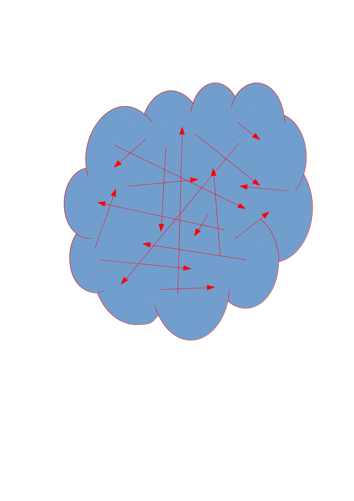

You inevitably enter in to a situation when making a new change in to your system 
becomes more and more expesive, or even impossible.

The following picture denotes the same situation but describes a project where programmer 
used a small scale separation of his code, by splitting it to modules.   

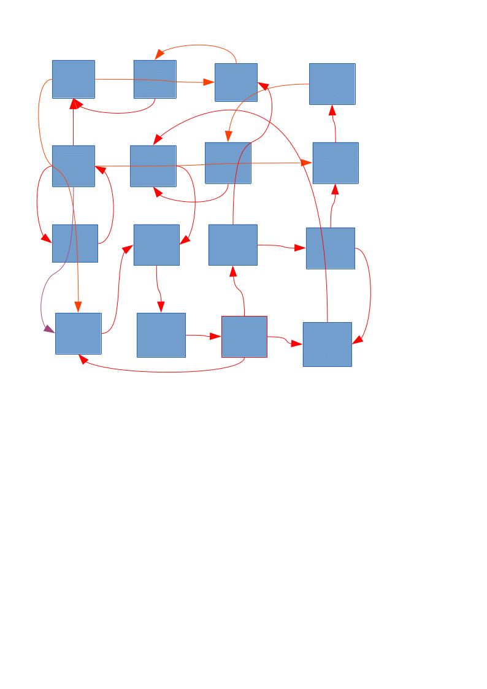

This is almost the same as the chaos situation except that, may be, code is more readable
but still problem remains the same: making a new change in to the system is almost impossible
due to a too strong coupling between its separate parts.

## Layering architecture proposition.

First of all let's try to draw bounds between modules. 
There are various aspects of how to define bounds: by the functionality type, 
by data access types, by call depth .. etc. We will propose exact criterias later.    

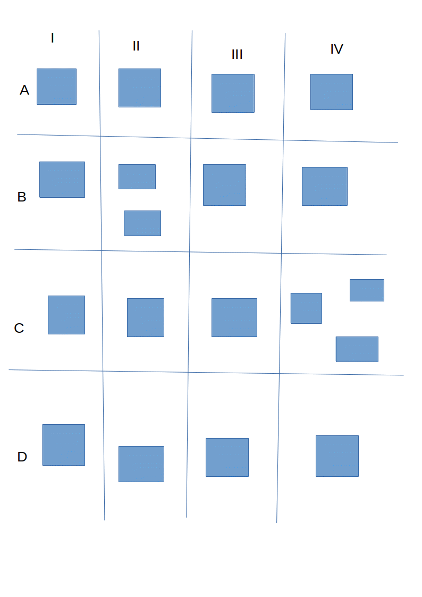

Let's say that relation between more than one bound is illegal.

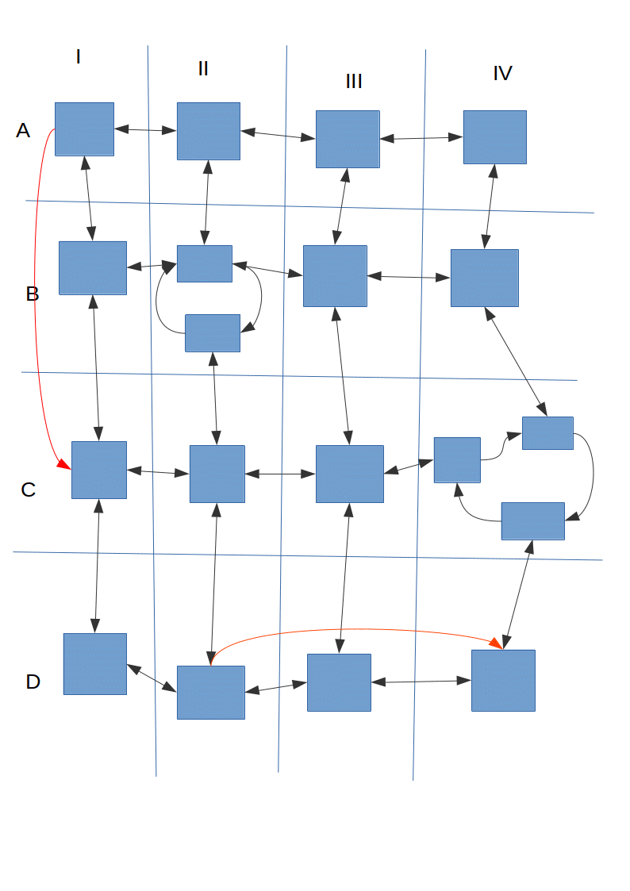

This way, if we replace one module/class/function, we will need to fix 
only neighbouring module/class/function code.\
In the result the price of your system change is limited to **a count of neighbouring modules**.
 
This is our gain.
  
### Layers by call depth architecture proposition for an API application
We propose a layering architecture where we divide classes/modules horizontaly to three main layers:
1. Entry point layer 
2. Business logic layer
3. Data access layer

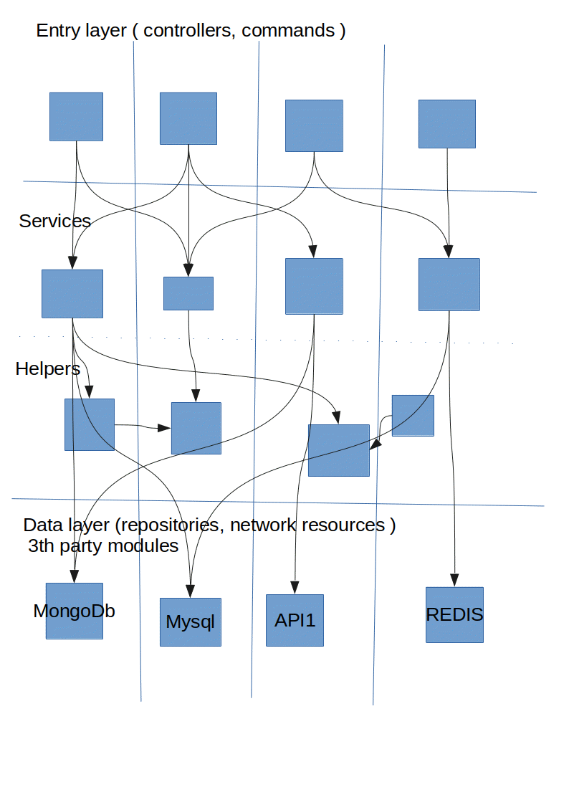

#### Entry point layer
Entry point layer consists of controllers and commands. 
Commands are out of the API functionality, but systems often need to run some tasks in the background,
called by cronjobs or other hosting system services. So the command comes as the entry point classes 
of our layering system. Entry point layer is responsible to communicate with ouside world. 
This layer is responsible for the following tasks: 
1. **authentication** 
2. **decrypting of input data**
3. **encryption of response data to an acceptable format(json/xml/etc...)**

#### Busines logic layer.
Here the services and helpers belongs to. 
**Services** may be also sublayered to ones which have some reusable methods, and ones 
that should be called strictly from entry point layer.
**Helpers** consists of Pure functions. These are easiest to test, 
so if you want to cover your project with tests, you chould try to put 
as mutch code in to helpers as possible.
This layer is responsible for the following tasks:
1. **Business logic calculations**
2. **Handling calls to a data level services**
3. **Data mapping**  

#### Data access layer
The repositories and database specialized  services should be put here. The methods of these services must 
be as mutch reusable as possible.
This layer is responsible for the following tasks:
1. **Transforming data to a storage source formats**
2. **Building requests/queries to databases, outside api's**
3. **Handling storage/api specific errors**

#### Data  classes
Each layer has own data classes, used to communicate between layers.

### Vertical layers
The vertical layering is used to split modules by functionality. In the picture above, 
the vertical layers are not exact as it should be: the functionality of controllers 
**is not related** to functionality of data layer modules in any sense.

### Limitations, comming from layers.

**Accessing between two horizontal layers is forbiden**

In the picture below is drawn a bad access example.
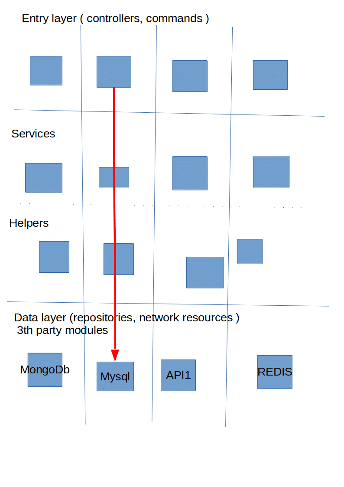
The controller tried to access database layer service. 
This is forbiden in the layering architecture.

The solution is to delegate call through some Bussiness layer service, 
or **better** organize your code logic so that this call wouldn't be needed.
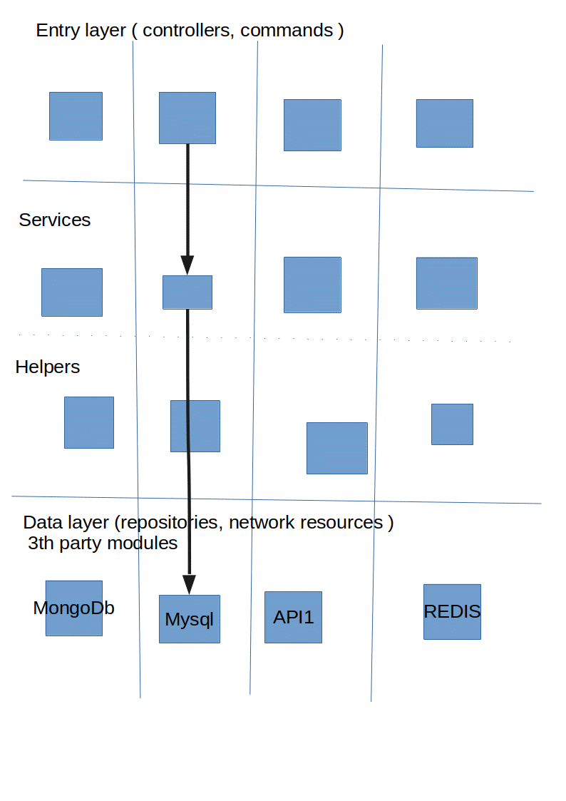

**Calls between entry points**

The solution is to move a reusable code to a service class and make calls to it 
from these two controllers.
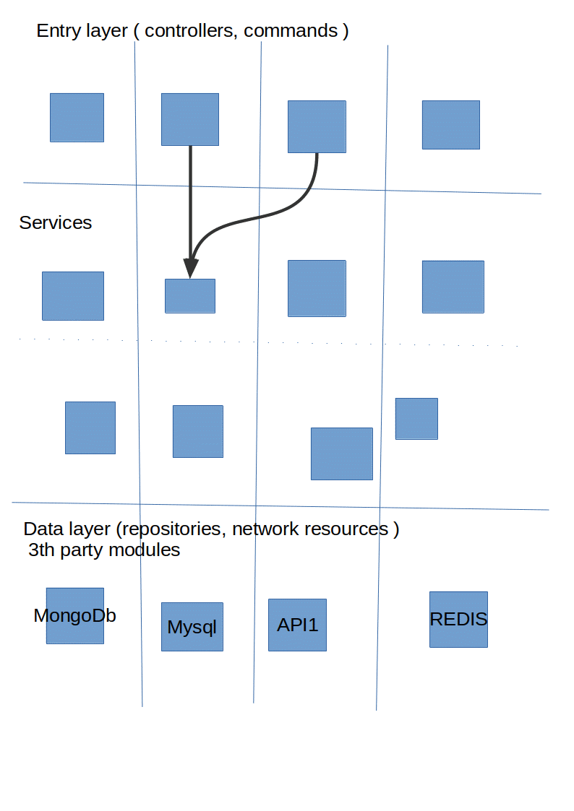

**Calls between data layer service**
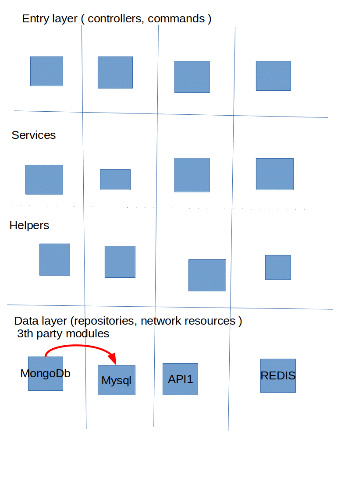

If you want to pass data from one data source to other, you should make separate calls 
from the business logic layer service.
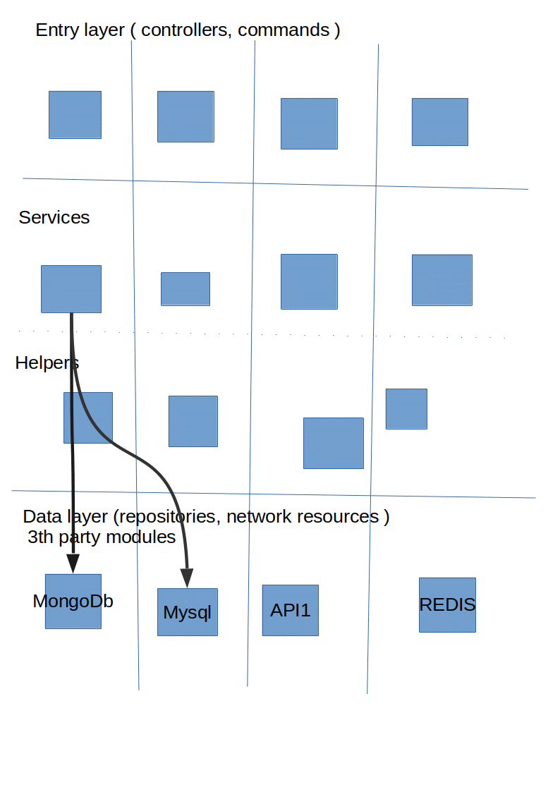

**Overloading functions with both data load and transformation**
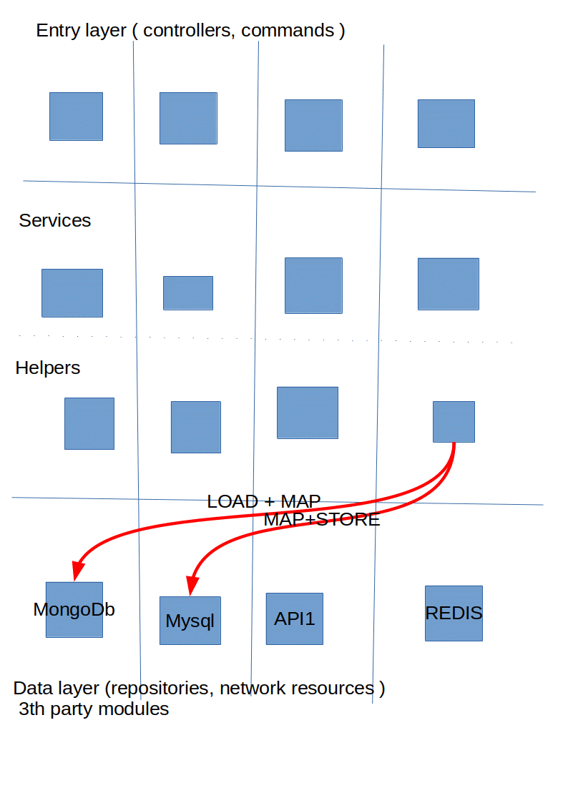

Its better to make pure calls with a native data structure to the data source and the 
transformation should be made in **a helper**. 
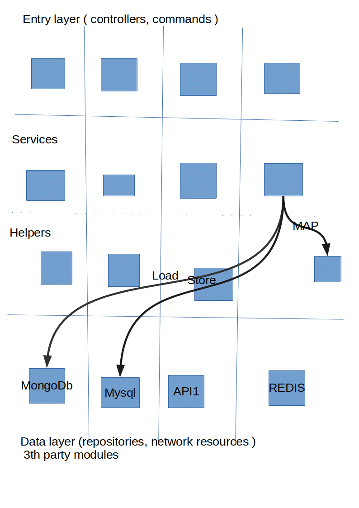

**Too mutch horizontal calls between business logic services**
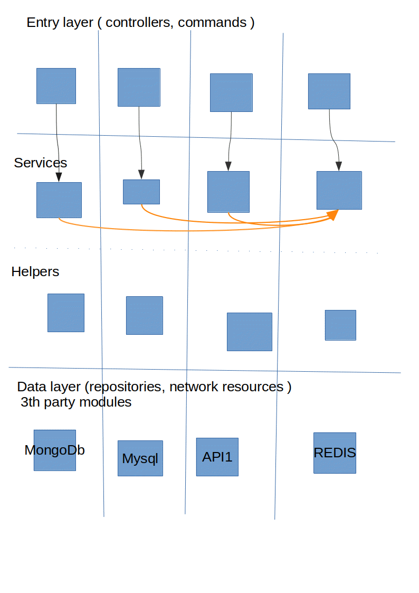

The solution is to make sublayer inside the business logic layer, and put a reusable 
code in that layer service.
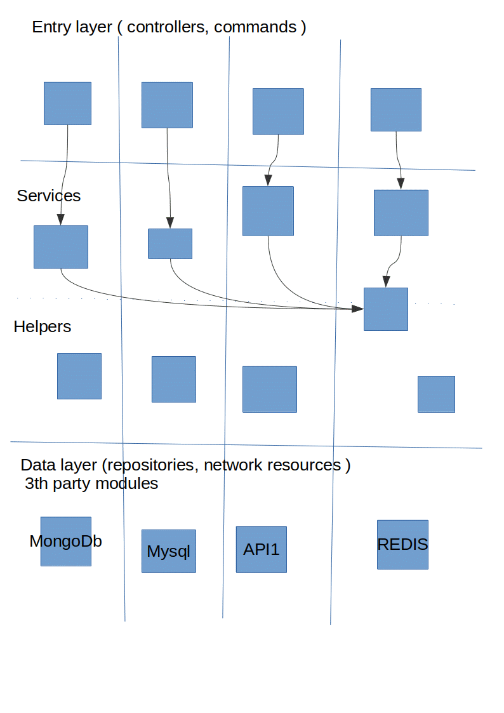

### Opposition

1. Why should we limitate ourselves?
2. Its mutch simpler to directly call this method instead of delegating.
3. I like to see everything in one place.

Yes the system should be flexible and should allow you to brake some rules. But this should be counted only as an 
exception from the rule. 
 
Also the opposite is true also: its **easy** to make a **wrong** system and **hard** to make **robust** and modifiable.
  
But when you are used to work in a good way this stops to be hard for you and removes a lot of problems in future.

### Untouched questions

1. Data structures isolations.
2. Exception handling.

May be we touch these questions in separate papers.

## Conclusions.

1. Layering architecture proposed to decouple any application.
2. The gain of the layering is explained.
3. Good and bad examples provided.
4. Mentioned of the untouched questions.